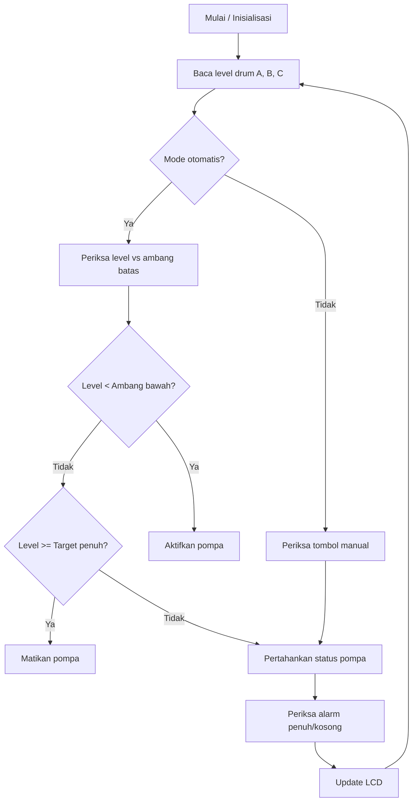

# Drum Monitoring & Control System – STM32

## 📌 Deskripsi

Program ini dibuat untuk **STM32** (menggunakan STM32CubeIDE) untuk memantau level tiga drum (A, B, dan C) dan mengontrol pompa serta alarm berdasarkan level air/fluida. Sistem menggunakan **LCD 16x2**, **buzzer**, **lampu indikator**, dan **input tombol**.

Fitur utama:

* Monitoring level drum A, B, C dalam persen (%).
* Kontrol pompa secara otomatis atau manual.
* Alarm penuh/kosong dengan LED & buzzer.
* Dukungan **auto cut-off** pompa.
* Tampilan status real-time di LCD.
* Konfigurasi parameter ambang batas penuh/kosong.

---

## ⚙️ Fitur Utama

1. **Pengukuran Level Drum**
2. **Kontrol Pompa Otomatis & Manual**
3. **Alarm Penuh/Kosong**
4. **LCD Display Real-time**
5. **Konfigurasi Parameter Ambang Batas**

---

## 📋 Struktur Program

* **`main.c`** – logika utama, kontrol pompa, pembacaan sensor, update LCD.
* **`main.h`** – definisi pin dan konfigurasi hardware.

---

## 🔧 Hardware yang Dibutuhkan

* STM32 (misal STM32F103C8T6)
* LCD 16x2 I2C
* Sensor level air (A, B, C)
* Pompa air (A, B, C)
* Relay driver
* LED indikator
* Buzzer
* Tombol kontrol manual

---

## 📌 Daftar Pin (`main.h`)

| Pin Name     | Port | Fungsi               |
| ------------ | ---- | -------------------- |
| USER\_BTN    | PA0  | Tombol pengguna      |
| SPI1\_CS     | PA4  | Chip Select SPI1     |
| POMPA\_1\_ON | PB0  | Tombol pompa 1 ON    |
| POMPA\_2\_ON | PB1  | Tombol pompa 2 ON    |
| USER\_LED    | PB2  | LED indikator umum   |
| LED\_GREEN   | PB12 | LED indikator penuh  |
| LED\_RED     | PB13 | LED indikator kosong |
| POMPA\_BA    | PB14 | Output pompa BA      |
| POMPA\_CB    | PB15 | Output pompa CB      |
| BUZZER       | PA8  | Output buzzer        |
| TRIG\_1      | PB3  | Trigger sensor 1     |
| TRIG\_2      | PB5  | Trigger sensor 2     |
| TRIG\_3      | PB7  | Trigger sensor 3     |

---

## 📜 Cara Kerja Singkat

1. Inisialisasi hardware dan parameter.
2. Baca level drum.
3. Kontrol pompa sesuai mode.
4. Aktifkan alarm jika penuh/kosong.
5. Update tampilan LCD.

---

## 📊 Diagram Alur Logika Kontrol

